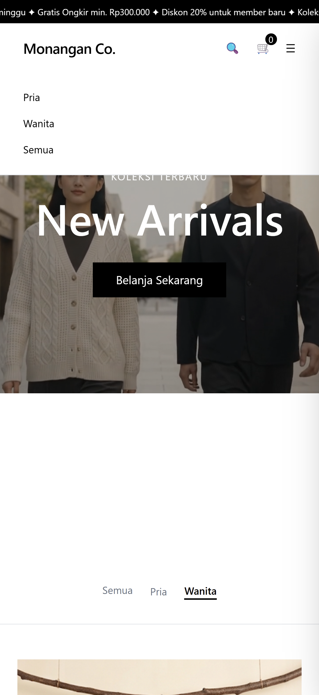
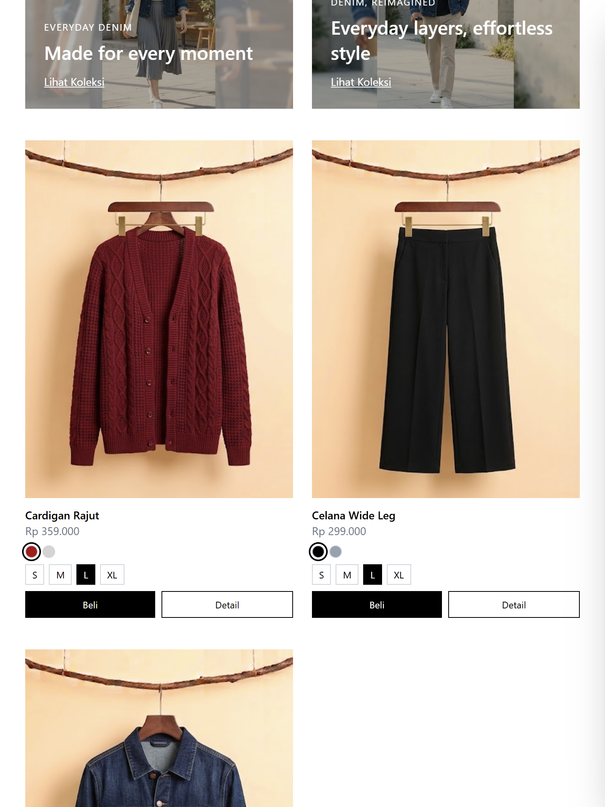
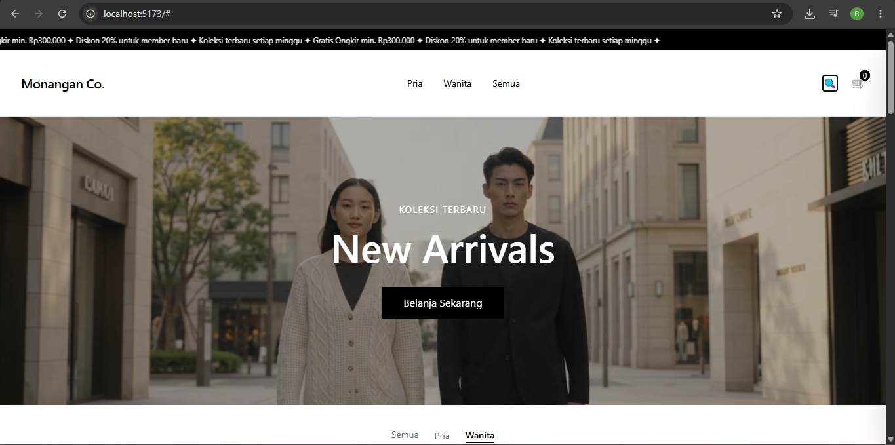

# Monangan Co. — Katalog Produk Responsif

Tugas Rutin 3 — Pemrograman Web (Pertemuan 3), FMIPA UNIMED

Katalog produk fashion responsif terinspirasi dari gaya minimalis Uniqlo, dibangun dengan Tailwind CSS + Vite. Menampilkan grid produk yang menyesuaikan ukuran layar, filter kategori, mini cart, dan search — dibuat mobile-first.

## Fitur

- Navbar responsif dengan hamburger menu di mobile + mega dropdown menu di desktop
- Hero section dengan video background
- Filter kategori (Pria / Wanita / Semua) dengan JavaScript
- Grid produk responsif: 1 kolom (mobile) → 2 kolom (tablet) → 3-4 kolom (desktop)
- Swatch warna interaktif (ganti foto produk sesuai warna)
- Size selector (S/M/L/XL)
- Mini cart drawer dengan quantity & hapus item
- Search bar dengan filter live
- Sort dropdown (harga & nama)
- Animasi scroll reveal pada kartu produk
- Banner promosi di antara grid produk

## Teknologi 

- HTML5 semantik
- Tailwind CSS (utility-first)
- Vite (build tool)
- JavaScript murni (vanilla JS, tanpa framework)

## Breakpoint yang Digunakan

| Breakpoint | Lebar | Perubahan Layout |
|---|---|---|
| Mobile | < 640px | 1 kolom produk, navbar hamburger |
| Tablet (sm/md) | 640px – 1024px | 2 kolom produk |
| Desktop (lg) | 1024px – 1280px | 3 kolom produk, navbar penuh |
| Large (xl) | > 1280px | 4 kolom produk |

## Dokumentasi Testing Responsivitas

Testing dilakukan menggunakan Chrome DevTools Device Mode pada 3 breakpoint berikut:

### 1. Mobile — 480px (iPhone SE)


### 2. Tablet — 768px (iPad Mini)


### 3. Desktop — 1280px+ (/ Large screen)


## Cara Menjalankan Project

```bash
npm install
npm run dev
```

Buka `http://localhost:5173` di browser.

## Penulis

Rahmat Hamonangan Nasution
NIM: 4253250053
Mata Kuliah Pemrograman Web — FMIPA UNIMED
